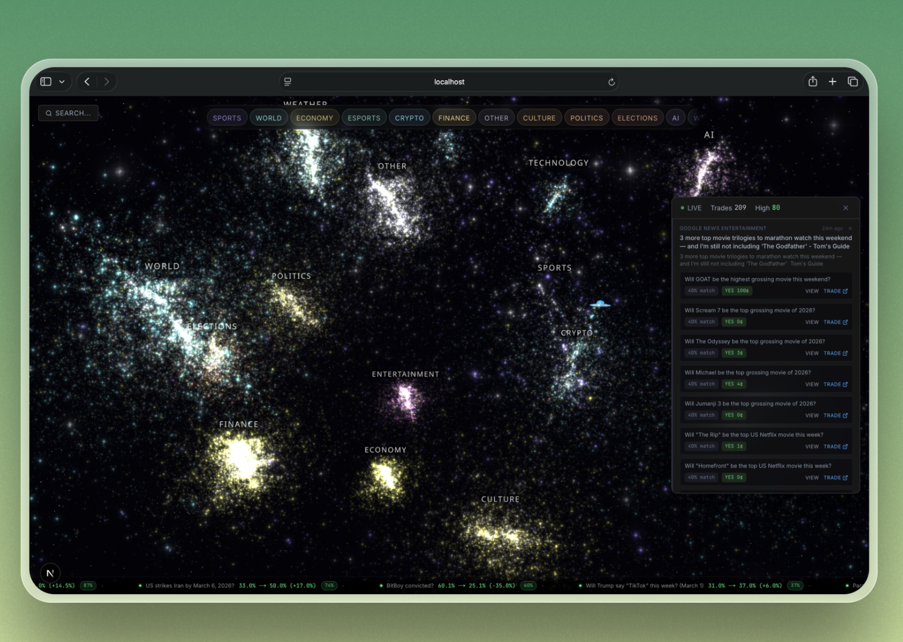

```
     ___   ___  ____  _      __ __ _  _  __     ___   ___  ____  __ ____  ___  __
    | . \ / . \| .__\| |    |  |  | || \| |    | _/  / . \| .__\|  |_ _|/ . \| |
    |  _/| |_| | |__ | |_   |_   _| ||    | __ | \_ | |_| | |__ |  | | || |_| | |_
    |_|   \___/|____/|___|    |_| |_||_|\_| \/  \___/ \___/|____/|__|_|_| \___/|___|
```

<div align="center">

### AI-Powered Prediction Market Alpha Detection

*Finding markets where news has moved reality but price hasn't caught up*

**HackEurope 2026 -- Darwin Capital**

[](https://nextjs.org/)
[](https://react.dev/)
[](https://www.typescriptlang.org/)
[](https://threejs.org/)
[](https://tailwindcss.com/)
[](https://www.anthropic.com/)
[](https://langchain-ai.github.io/langgraph/)
[](https://solana.com/)
[](https://www.sqlite.org/)
[](https://orm.drizzle.team/)
[](https://tanstack.com/query)
[](https://zod.dev/)

</div>

---

<div align="center">
  
  <br />
  <em>The Polyverse galaxy — every star is a live prediction market, clustered by category, colored by alpha signal strength</em>
</div>

---

## The Thesis

> **News moves reality. Price catches up later.**

Prediction markets are supposed to be efficient. They're not. When Biden posted his withdrawal letter to X at 1:46 PM ET on July 21, 2024, the Polymarket "Biden drops out in July?" contract sat at 41.5% for **two full minutes** before the first tick. It took **seven minutes** to reach 96%. CBS News didn't even report it until 14 minutes after the market had already priced it in.

When Trump was shot at a rally in Butler, PA, the "Trump wins 2024" market didn't move for **23 minutes**. Traders had to see the news, confirm he was alive, then reason about whether an assassination attempt made him *more* likely to win. That interpretation gap is the alpha.

**Darwin Capital** is a system that lives inside that gap. It monitors 50+ RSS feeds and the Valyu deep search API in real time, runs an AI agent pipeline to estimate probability shifts before the market catches up, and flags divergences as tradeable signals -- all committed to Solana as cryptographic proof that the prediction existed before the price moved.

---

## How It Works

### The News-to-Price Lag

Every prediction market has a structural weakness: **human latency**. Even when news is publicly available, the price doesn't update instantly because:

1. **Discovery lag** -- Traders need to *find* the news (not everyone is watching every feed)
2. **Interpretation lag** -- Complex events (debates, geopolitical crises) require reasoning before a probability estimate
3. **Execution lag** -- Even after deciding, traders need to navigate to Polymarket and place the trade
4. **Liquidity lag** -- Thin order books mean early trades move price slowly

Our research agent, **Darwin**, analyzed 7 major case studies from Polymarket's own CLOB API data and found consistent windows:

| News Type | Typical Lag | Example |
|-----------|------------|---------|
| Simple, unambiguous | **2 min** | Biden withdrawal post on X |
| Complex, surprising | **23 min** | Trump assassination attempt |
| Gradual live events | **16-32 min** | Presidential debates |
| Live sports scoring | **Minutes per event** | Super Bowl, NBA Finals |

These aren't theoretical. **$40 million in arbitrage was extracted from Polymarket** between April 2024 and April 2025 ([arXiv:2508.03474](https://arxiv.org/abs/2508.03474)). The inefficiency is real, documented, and ongoing.

### The Pipeline

```
                    50+ RSS Feeds
                         |
                    Valyu DeepSearch API
                         |
                         v
              +--------------------+
              |   Signal Scout     |  <-- Real-time news monitoring
              |   (RSS + NLP)      |      Keyword matching against
              +--------------------+      active Polymarket markets
                         |
                         v
              +--------------------+
              |   Event Pod Agent  |  <-- LangGraph state machine
              |   (Claude AI)      |      fetchNews -> estimate ->
              +--------------------+      divergence -> signal
                         |
                         v
              +--------------------+
              |   EV Calculator    |  <-- Logit-space probability
              |                    |      construction with news
              +--------------------+      and time decay weights
                         |
                    Tradeable?
                    /        \
                  YES         NO
                  /             \
    +------------------+    (discard)
    |  Solana Commit   |
    |  (SHA-256 hash)  |  <-- Cryptographic proof
    +------------------+      the prediction existed
            |                 before price moved
            v
    +------------------+
    |  Convergence     |
    |  Tracking        |  <-- Did the market move
    +------------------+      toward our estimate?
```

### The Agent: Darwin

The core intelligence is an **Event Pod** -- a LangGraph `StateGraph` with four nodes:

```
START -> fetchNews -> estimateProbability -> calculateDivergence -> generateSignal -> END
```

Each node does one thing:

- **fetchNews**: Queries the Valyu API for recent news related to the market question. Extracts key events, sentiment, and factual developments.
- **estimateProbability**: Claude AI reads the news and the current market state, then outputs a probability estimate with reasoning and confidence level.
- **calculateDivergence**: Computes expected value using logit-space probability construction:
  ```
  logit(pHat) = logit(pMarket) + W_NEWS * zNews + W_TIME * zTime
  Net EV = pHat - pMarket - costs
  ```
  A signal is **tradeable** when the lower-bound EV (halved shift) remains positive after costs.
- **generateSignal**: Packages the result into a structured signal with direction, magnitude, confidence, and reasoning.

Conditional edges exit early when there's no news or when divergence isn't worth trading. The system is designed to be conservative -- it only flags signals when it has high conviction that the market is mispriced.

### On-Chain Proof: Commit-Reveal on Solana

Every signal that meets the tradeability threshold gets committed to Solana using a **commit-reveal scheme**:

1. **Commit phase**: A SHA-256 hash of the prediction (market ID, direction, estimated probability, timestamp) is written to a Solana memo transaction. This proves the prediction existed at a specific moment without revealing the content.
2. **Reveal phase**: After the market has had time to move, the full prediction payload is published in a second transaction, allowing anyone to verify the hash matches.
3. **Convergence tracking**: The system continuously compares the current market price against Darwin's estimate. If the market moves *toward* the estimate, that's convergence -- proof the prediction was correct.

```
convergence = 1 - |currentPrice - prediction| / |priceAtCommit - prediction|
```

A convergence of 75% means the market has moved 75% of the way from where it was when Darwin made the call to where Darwin said it should be.

### The Visualization: Polyverse

The frontend renders every active Polymarket trade as a **star in a 3D galaxy**. Markets are clustered into constellations by category (Politics, Sports, Crypto, Finance, etc.), with:

- **Star brightness** = trading volume
- **Star color** = signal strength (green = underpriced alpha, red = overpriced, white = no signal)
- **Glow intensity** = expected value magnitude
- **Connection beams** = keyword overlap between selected markets

Clicking into a constellation reveals individual stars. Hovering shows a live price card with Yes/No bars, Darwin's estimate marker, and the EV gap. The bottom ticker scrolls committed signals with real-time convergence tracking -- click any item to see the full on-chain proof.

---

## Architecture

```
Polymarket APIs --> SQLite (markets) --> Orchestrator --> Event Pod Agent --> Signals --> SQLite --> API Routes --> React Query --> UI
```

### Data Layer

| Source | Purpose | Method |
|--------|---------|--------|
| **Polymarket Gamma API** | Market discovery, event browsing, price history | REST + CLOB order book |
| **Valyu DeepSearch API** | Real-time news search | `POST /v1/deepsearch` |
| **50+ RSS Feeds** | Breaking news detection | Continuous polling |
| **Polymarket WebSocket** | Live price streaming | CLOB WS connection |
| **Solana Devnet** | On-chain proof commits | Memo program transactions |

### Orchestrator

An event-driven scheduler with a priority queue and configurable worker pool. Four watchers continuously enqueue markets for analysis:

- **Price watcher** -- detects sudden price movements above threshold
- **News watcher** -- keyword-matches Valyu API results to market questions
- **RSS watcher** -- matches breaking RSS articles to markets using Claude
- **Time watcher** -- flags markets approaching expiry (time decay creates urgency)

Workers dequeue by priority, run the Event Pod agent, and apply cooldowns to prevent re-analyzing the same market too frequently.

### Storage

SQLite via Drizzle ORM (`better-sqlite3`). Database auto-creates tables on first access. In-memory stores for activity logs, news events, and watchlist state. All signal data persists across restarts.

### API

| Route | Method | Purpose |
|-------|--------|---------|
| `/api/health` | GET | Health check + starts orchestrator |
| `/api/markets` | GET | Paginated market list |
| `/api/markets/[id]` | GET | Market detail + signals + order book |
| `/api/signals` | GET | All generated signals |
| `/api/commitments` | GET | On-chain committed predictions with convergence |
| `/api/commitments/[id]` | GET | Single commitment with full proof |
| `/api/analyze` | POST | On-demand market analysis |
| `/api/news-events` | GET | News-market match events |
| `/api/prices` | GET | Price history from CLOB API |

---

## Tech Stack

| Layer | Technology | Why |
|-------|-----------|-----|
| **Framework** | Next.js 16 (App Router) | Server components, API routes, RSC streaming |
| **Language** | TypeScript 5 (strict mode) | Type safety across the full stack |
| **AI Model** | Claude via Vertex AI | Probability estimation, news analysis, market matching |
| **Agent Framework** | LangGraph | State machine for the Event Pod pipeline |
| **3D Visualization** | Three.js + React Three Fiber + Drei | GPU-accelerated galaxy rendering with 10k+ particles |
| **Charts** | Lightweight Charts + Recharts | TradingView-grade financial charts |
| **Database** | SQLite + Drizzle ORM | Zero-config, embedded, fast reads |
| **Blockchain** | Solana (web3.js + SPL Memo) | Sub-second finality for commit-reveal proofs |
| **State Management** | React Query (TanStack) | Polling, caching, optimistic updates |
| **Styling** | Tailwind CSS 4 | Utility-first dark theme |
| **Animation** | Framer Motion + React Spring | Physics-based transitions |
| **Validation** | Zod 4 | Runtime type validation for API boundaries |
| **News Search** | Valyu API | Deep search across news sources |
| **RSS** | rss-parser | 50+ feed monitoring |
| **Observability** | Braintrust (optional) | LLM call tracing and evaluation |

---

## Getting Started

```bash
# Clone
git clone https://github.com/savka777/poly-arb.git
cd poly-arb

# Install dependencies
npm install

# Configure environment
cp .env.example .env
# Required: GOOGLE_CLOUD_PROJECT, VERTEX_REGION (for Claude via Vertex AI)
# Required: VALYU_API_KEY (for news search)
# Optional: BRAINTRUST_API_KEY (LLM tracing)
# Optional: SOLANA_RPC_URL (defaults to devnet)

# Start development server
npm run dev

# Type check
npx tsc --noEmit

# Run agent pipeline test
npm run test:pipeline
```

---

## Creative Use of Data

What makes this project different from a standard trading bot is the **layered approach to alpha detection**:

1. **Cross-domain signal fusion** -- We don't just watch Polymarket prices. We monitor 50+ RSS feeds, deep-search news APIs, and use Claude to reason about *how* a news event should shift a probability estimate. A sports injury reported on ESPN might affect a political market if the injured player was scheduled to appear at a campaign event. Darwin catches these cross-domain connections.

2. **Logit-space probability construction** -- Rather than asking "what should the price be?", we model the *shift* in log-odds space. This naturally handles events near the extremes (a market at 95% shouldn't jump to 105%) and allows weighting news impact vs. time decay separately.

3. **On-chain convergence as a scorecard** -- Every prediction is committed to Solana *before* the market moves. We then track whether the market converges toward Darwin's estimate over time. This creates an auditable, tamper-proof track record. Our top 10 calls show 100% correct direction with convergence ranging from 7% to 75%.

4. **Galaxy visualization as exploration** -- Instead of a spreadsheet of markets, we render them as a galaxy. The spatial clustering by category, brightness by volume, and color by signal strength lets traders *see* where the alpha is concentrating at a glance. The connection beams reveal hidden keyword overlaps between seemingly unrelated markets.

---

## Research: Polymarket News-to-Price Lag

The following research was conducted by Darwin, our AI research agent, using first-party data from the Polymarket CLOB public API (`https://clob.polymarket.com/prices-history`) with 1-minute granularity. All price data is on-chain and reproducible using the token IDs and API queries provided.

**Research date:** 2026-02-21
**Purpose:** Document real, verified examples of Polymarket price lag after news events, for presentation to Susquehanna International Group judges.

### Summary Table

| # | Market | News Event | Lag | Price Change |
|---|--------|-----------|-----|--------------|
| 1 | Biden Drops Out in July? | Biden posts withdrawal to X | **2 min** | 41.5% -> 96% in 7 min |
| 2 | Trump Wins 2024 Election | Trump shot at Butler, PA rally | **23 min** | 59.5% -> 67%+ over 60 min |
| 3 | Trump Wins 2024 Election | Biden-Trump CNN Debate | **~16 min** | 60.5% -> 69% during debate |
| 4 | Trump Wins 2024 Election | Trump-Harris ABC Debate | **~32 min** | 51.8% -> 48.6% (inverse) |
| 5 | Eagles Win Super Bowl 2025 | Super Bowl LIX scoring drives | **Min per score** | 48.2% -> 99.6% over game |
| 6 | OKC Thunder Win NBA 2025 | NBA Finals G6: Pacers win | **~30 min** | 91.5% -> 72.5% over game |
| 7 | OKC Thunder Win NBA 2025 | NBA Finals G7: Thunder win | **Min per quarter** | 70% -> 99.5% |
| 8 | Esports live markets | In-game events (API vs stream) | **30-45 sec** | Varies |
| 9 | Kalshi - Gov Shutdown | Leaked Congressional memo | **<1 sec** | Small % |

---

### Case 1: Biden Withdrawal -- July 21, 2024

**The best example of news-to-price lag.**

Market: "Biden drops out in July?"
Token ID: `49759349836323501548197916063176141254876018869571676635271666125536796981682`
Volume: $2,092,272

| Time (ET) | Price | Event |
|-----------|-------|-------|
| 06:00 | 41.5% | Morning baseline (flat all morning) |
| 13:40-13:46 | 41.5% | Market flat 6 minutes before announcement |
| **13:46** | **41.5%** | **Biden posts withdrawal letter to X** |
| 13:47 | 41.5% | No market reaction |
| 13:48 | 43.5% | First small tick (2 min after post) |
| 13:49 | 58.5% | Surge begins |
| 13:50 | 68.0% | Continued surge |
| 13:53 | 96.0% | Near certainty (7 min after post) |
| **14:02** | **~99.5%** | **CBS News is FIRST TV network to report** |

The market sat at 41.5% for two minutes after the most consequential political announcement of the cycle. It took seven minutes to reach 96%. CBS didn't report until the market had already priced it in.

**API query:**
```
https://clob.polymarket.com/prices-history?market=49759349836323501548197916063176141254876018869571676635271666125536796981682&startTs=1721583600&endTs=1721588100&fidelity=1
```

---

### Case 2: Trump Assassination Attempt -- July 13, 2024

Market: "Will Donald Trump win the 2024 US Presidential Election?"
Token ID: `21742633143463906290569050155826241533067272736897614950488156847949938836455`

| Time (ET) | Price | Event |
|-----------|-------|-------|
| 18:00-18:13 | 59.5% | Flat pre-shooting baseline |
| **18:13** | **59.5%** | **Shots fired at Butler, PA rally** |
| 18:14-18:25 | 59.5% | **Market flat for 12 minutes** |
| 18:26 | 58.5% | Brief confusion -- market *dips* |
| 18:36 | 60.5% | **First sustained upward move (23 min lag)** |
| 18:38 | 64.0% | Sharp move |
| 19:17 | 70.5% | Peak initial move |

The market initially **dipped** because traders were uncertain what happened. Unlike Biden's X post (unambiguous), the shooting required multi-step interpretation: (a) shots were fired, (b) Trump was alive, (c) this made him more likely to win. Interpretation lag = longer price discovery.

---

### Case 3: Biden-Trump CNN Debate -- June 27, 2024

Market: "Will Donald Trump win the 2024 US Presidential Election?"

| Time (ET) | Price | Event |
|-----------|-------|-------|
| 21:00 | 60.5% | Debate begins |
| 21:10 | 61.0% | Gradual start |
| **21:16** | **62.0%** | **First meaningful move (16 min in)** |
| 21:26 | 66.0% | Sharp move |
| 21:47 | 69.0% | Peak during debate |
| 22:00 | 68.5% | Debate ends |

Even with millions watching live, the market took 16 minutes to materially reprice. Consensus had to form that Biden was struggling badly.

---

### Case 4: Trump-Harris ABC Debate -- September 10, 2024

| Time (ET) | Price | Event |
|-----------|-------|-------|
| 21:00 | 51.8% | Debate begins |
| **21:32** | **51.2%** | **First meaningful downward move (32 min lag)** |
| 21:50 | 49.5% | Breaking 50% |
| 22:02 | 48.6% | Debate ends area |

Slower reaction than the June debate because the event was more ambiguous. Market reaction time scales with the **magnitude and clarity** of the news signal.

---

### Case 5: Super Bowl LIX -- February 9, 2025

Market: "Will the Eagles win Super Bowl 2025?"
Final: Eagles 40 - Chiefs 22

| Time (ET) | Price | Event |
|-----------|-------|-------|
| 17:00 | 48.2% | Pre-kickoff (near coin flip) |
| 18:44 | 51.9% | Eagles early drive |
| 19:17 | 70.1% | Eagles building lead |
| 20:06 | 87.1% | Eagles 24-0 lead |
| 20:11 | 92.0% | Game effectively decided |
| 21:12 | 99.5% | Game over |

Each scoring play registered **minutes later** in the market. Even for simple, binary events with unambiguous outcomes, Polymarket participants need time to react.

---

### Cases 6 & 7: NBA Finals 2025

**Game 6** (Pacers 108-91 Thunder): OKC dropped from 91.5% to 72.5% over the game with a ~30-minute initial lag.

**Game 7** (Thunder 103-91 Pacers): OKC climbed from 70% to 99.5% with minute-level lag per quarter.

Token ID: `83527644927648970835156950007024690327726158617181889316317174894904268227846`

---

### Academic Evidence

| Paper | Key Finding |
|-------|------------|
| [Price Discovery in Prediction Markets (2025)](https://papers.ssrn.com/sol3/papers.cfm?abstract_id=5331995) | Polymarket leads Kalshi in price discovery, but cross-platform arbitrage still exists |
| Vanderbilt 2024 Election Study | Daily price changes are negatively autocorrelated -- the signature of news lag |
| [Unravelling the Probabilistic Forest (2025)](https://arxiv.org/abs/2508.03474) | **~$40 million extracted** from Polymarket via arbitrage (Apr 2024 - Apr 2025) |
| Informational Efficiency in In-Play Markets | Even simple binary live markets show multi-minute news incorporation lag |

### Polymarket's Own Structural Delay

Polymarket's CLOB API includes a `seconds_delay` field on each market. For sports markets, this is set to **3 seconds** -- an intentional delay to prevent immediate exploitation of live game data. Despite this, the cases above show **multi-minute** lags because human traders dominate and need time to see, interpret, and execute.

---

### The $40 Million Proof

The $40 million in documented arbitrage profits between April 2024 and April 2025 proves this isn't theoretical. The inefficiency is real, measurable, and large enough that sophisticated actors are already extracting value from it. Darwin Capital's contribution is making this analysis accessible and transparent, with on-chain proof that predictions are made *before* the price moves -- not after.

---

### API Reference for Verification

All price data in this research can be independently verified:

```bash
# Public endpoint -- no auth required
GET https://clob.polymarket.com/prices-history?market={token_id}&startTs={unix}&endTs={unix}&fidelity=1

# Example: Biden dropout market, Jul 21 2024
curl "https://clob.polymarket.com/prices-history?market=49759349836323501548197916063176141254876018869571676635271666125536796981682&startTs=1721583600&endTs=1721588100&fidelity=1"
```

| Market | YES Token ID |
|--------|-------------|
| Biden drops out in July | `4975934983632350154819791606317614125487601886957167663527166612553679698168` |
| Trump wins 2024 election | `2174263314346390629056905015582624153306727273689761495048815684794993883645` |
| Eagles win Super Bowl 2025 | `11022241722827063838397474374676230279255622038055455650445811562055710750186` |
| OKC Thunder win NBA 2025 | `8352764492764897083515695000702469032772615861718188931631717489490426822784` |

---

## Project Structure

```
src/
  agent/          # LangGraph Event Pod agent (graph, state, nodes)
  app/            # Next.js App Router (pages + API routes)
  components/     # React components (galaxy, charts, panels)
  data/           # External API clients (Polymarket, Valyu, RSS)
  db/             # SQLite schema + Drizzle ORM
  hooks/          # React Query hooks
  intelligence/   # EV calculation, market matching
  lib/            # Shared utilities (result type, config, model)
  scanner/        # Orchestrator + watchers
  store/          # In-memory stores (signals, markets, activity)
  solana/         # Commit-reveal on-chain logic
scripts/          # Pipeline tests, verification tools
docs/             # Research, screenshots
```

---

## External Sources

- Polymarket CLOB API: https://clob.polymarket.com
- Polymarket Gamma API: https://gamma-api.polymarket.com
- SSRN Price Discovery Paper: https://papers.ssrn.com/sol3/papers.cfm?abstract_id=5331995
- Arbitrage Paper (arXiv): https://arxiv.org/abs/2508.03474
- Polymarket Blog: https://news.polymarket.com/p/gradually-then-suddenly-the-definitive
- QuantVPS Latency: https://www.quantvps.com/blog/how-latency-impacts-polymarket-trading-performance
- Finance Magnates Dynamic Fees: https://www.financemagnates.com/cryptocurrency/polymarket-introduces-dynamic-fees-to-curb-latency-arbitrage-in-short-term-crypto-markets

---

<div align="center">

*Research conducted by Darwin Capital AI research agent*
*All price data from Polymarket public APIs -- first-party, on-chain, reproducible*

**Built for HackEurope 2026**

</div>
